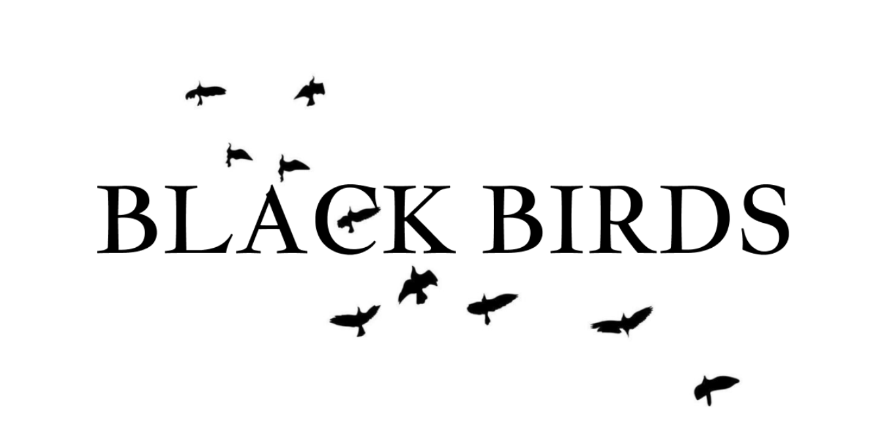

<h1 align="center">Black birds</h1>

  

 

## 📝 Table of contents

- [Description](#description)
- [Technologies](#technologies)
- [Documents](#documents)
- [Contributors](#contributors)
- [Download](#download)

## 💻 Description 
- Our idea, which will accept from the many, is to digitize the way of yawning 📲.

  
## ⚒️ Technologies 

- [Visual Studio](https://visualstudio.microsoft.com/) - Application
- [Teams](https://teams.microsoft.com/) - Communication
- [Word](https://www.microsoft.com/en-us/microsoft-365/word) - Documentation
- [PowerPoint](https://www.microsoft.com/en-us/microsoft-365/powerpoint) - Presentation
- [Excel](https://www.microsoft.com/en-us/microsoft-365/excel) - QA Documentation
- [Photoshop](https://www.adobe.com/) - Logo

## 📄 Documents
  <ul>
    <li><a href="docs/Documentation.docx">🧾 Documentation</a></li>
    <li><a href="docs/Presantation.pptx">📰 Presentation</a></li>
   </ul>

## 🧑🏻‍💻 Contributors 

- <a href = "https://github.com/RAAleksandrov21">🧑🏻 Radomir Aleksandrov </a> (Scrum Trainer)
-   <a href = "https://github.com/SZGeorgiev21">👦🏻 Stilian Georgiev </a> (Front-end Developer)
- <a href = "https://github.com/EEMustafa21">🧒🏻 Enis Mustafa </a> (Back-end Developer)
-  <a href = "https://github.com/ISDelchilov21">🧑🏻 Ivan Delchilov </a> (Back-end Developer)

## 📥 Download 

To download our project on your machine you just need to clone it. This can be done by pasting this text in your command prompt 💻:

<pre>git clone https://github.com/RAAleksandrov21/Black-birds.git</pre>
